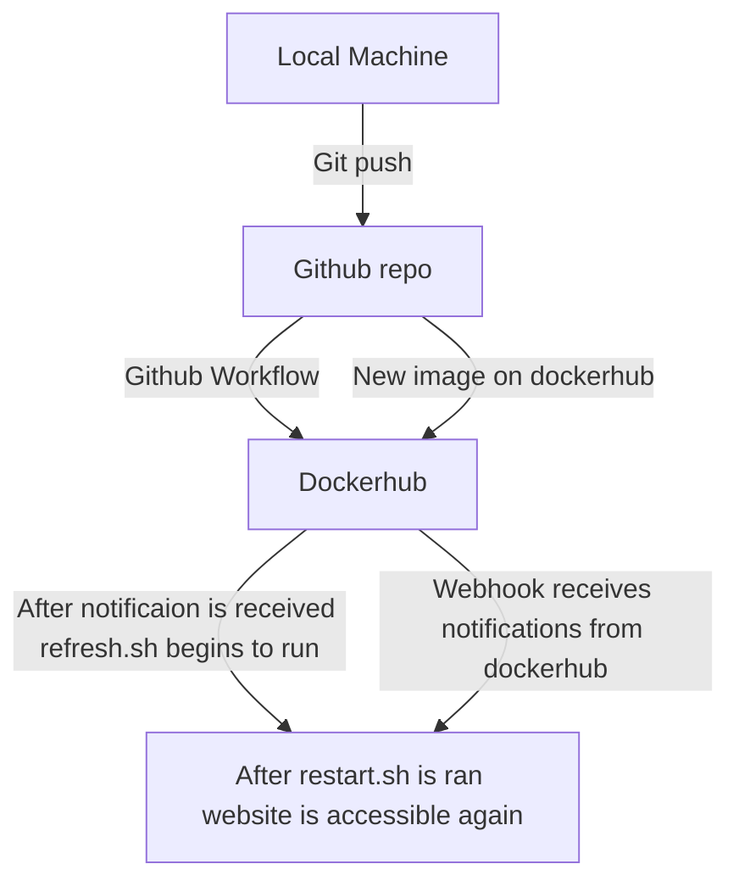

### Part 1 - Dockerize it

- Run Project Locally
  - how you installed docker + dependencies (WSL2, for example)
    - To install Docker, do `sudo apt install docker.io`
  - how to build the container
    - To build the container, do `sudo docker build -t my-apache2 .`
  - how to run the container
    1. `sudo docker run --rm -it -p 8080:80 ubuntu`
    2. `sudo docker run --rm -it -p 8080:80 ColinGrime/mysite:latest`
  - how to view the project (open a browser...go to ip and port...)
    - Open a browser -> Go to `http://localhost:8080/`.
  
### Part 2 - GitHub Actions and DockerHub  
  
- Create DockerHub public repo
  - process to create
    - Access your DockerHub -> Select `Create Repo` -> Choose a Name/Description -> Select `Create`.
- How to authenticate with DockerHub via CLI using Dockhub credentials
  - `Account Settings` -> `Security` -> `New Access Token` -> Select the `Read, Write, and Delete` option -> Save the token.
  - Next, in your WSL2, type `docker login -u crgime` and enter your access token.
- How to push container to DockerHub
  - `docker push cgrime/mysite:latest`
- Configure GitHub Secrets
  - what credentials are needed - DockerHub credentials (do not state your credentials)
    - `Account Settings` -> `Security` -> Go to `Secrets` to access your username/token.
  - set secrets and secret names
    - With the `.secrets` tag, you can use them in YAML files.
    - To access the DockerHub username, you do `secrets.DOCKER_USERNAME`.
    - To access the DockerHub token, you do `secrets.DOCKER_TOKEN`.
- Behavior GitHub Workflow
  - what does it do and when
    - Workflows are custom automated processes that you can set up in your repository to build, test, package, release, or deploy any project on GitHub.
  - variables to change (repository, etc.)
    - The variables we need to change are the DockerHub secrets, so the username/password and image name.

GitHub Workflow (found in the .github/workflows folder):
```
name: docker-build-push

on: [push]

env:
  DOCKER_REPO: mysite

jobs:
  docker-build-push:
    runs-on: ubuntu-latest
    steps:
      - name: checking out repo
        uses: actions/checkout@v3
      - run: echo "post-checkout" && ls -lah && pwd
      - name: login to docker hub
        uses: docker/login-action@v1
        with:
          username: ${{ secrets.DOCKER_USERNAME }}
          password: ${{ secrets.DOCKER_TOKEN }}
      - name: docker buildx
        uses: docker/setup-buildx-action@v1
      - name: build and push
        uses: docker/build-push-action@v2
        with:
          push: true
          tags: ${{secrets.DOCKER_USERNAME }}/${{ env.DOCKER_REPO }}:latest
```
  
### Part 3 - Deployment

- Container restart script
  - Found in the `pull-restart.sh` file, pasted below:
 ```
#!/bin/bash

# Pull docker image
# Docker pull cgrime/mysite:latest
# Kill old running container (to clear host port)
echo "stopping contianer"
docker stop doggo

# Prunes latest
docker system prune -f -a

# Pull docker image post prune
echo "pulling image"
docker pull cgrime/mysite:latest

# Run new image
echo "run image doggo"
docker run -d --name doggo -p 80:80 cgrime/mysite:latest
```

- Webhook task definition file
  - Found in the `redeploy.json` file, pasted below:
```
[
        {
                "id": "redeploy",
                "execute-command": "/home/ubuntu/pull-restart.sh",
                "command-working-directory": "/var/webhook"
        }
]
```

- Setting up a webhook on the server
  - How you created you own listener
    - `/home/ubuntu/go/bin/webhook -hooks /home/ubuntu/redeploy.json -verbose >> /home/ubuntu/logs`
  - How you installed and are running the [webhook on GitHub](https://github.com/adnanh/webhook)
    - Download Go -- `sudo snap install go`
    - Extract files -- `sudo tar -C /usr/local -xzf go1.18.1.linux-amd64.tar.gz`
    - Add to .profile -- `echo "export PATH=$PATH:/usr/local/go/bin">> .profile`
    - Install Webbook -- `go install github.com/adnanh/webhook@latest`
    - Redirect to logs.txt -- `/home/ubuntu/go/bin/webhook -hooks /home/ubuntu/redeploy.json -verbose >> /home/ubuntu/logs.txt`
- Setting up a notifier in DockerHub
  - Go to your repo -> Select `Webhooks` -> Enter your details @ `http://ipaddress:9000/Target=targetToken`.

### Part 4 - Diagramming


